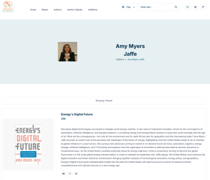
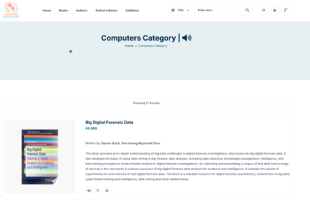

# Online Bookstore Web App

A responsive full-stack web application that allows users to browse books by category, search the catalog, view previews, and read book excerpts. The platform also provides detailed information about authors and includes a text-to-speech feature for book descriptions.

🔗 **Live Demo:** [Click here to view the project](https://proj.ruppin.ac.il/cgroup78/test2/tar6/index.html)


## ✅ Features

- Book search  
- Category-based filtering  
- View book previews and read excerpts  
- Detailed author information  
- User authentication (login/signup)  
- Personal bookshelf: track books read and liked  
- Text-to-speech feature for book descriptions (click-to-read aloud)

## 🛠️ Tech Stack

- **Frontend:** HTML, CSS, JavaScript  
- **Backend:** ASP.NET Core (C#)  
- **Database:** SQL Server

## ⚙️ Running the Project

⚠️ This project is not plug-and-play. To run it locally or on a server, you’ll need to:
- Deploy the backend files to a suitable .NET hosting environment  
- Configure the database connection and environment variables  
- Set up a SQL Server instance and initialize the required schema  

Due to these requirements, this project is recommended for users familiar with full-stack .NET development and deployment.

## 📁 Folder Structure

```
Online-Bookstore-Web-App/
├── Client/                   # Frontend - static HTML, CSS, JS
│   ├── assets/
│   │   └── screenshots/      # Screenshots for documentation
│   ├── *.html                # All frontend pages (home, shop, cart, contact, etc.)
├── Server/                   # ASP.NET Core backend
│   ├── BL/                   # Business Logic (Author, Book, Category, User)
│   ├── Controllers/          # Web API controllers (Authors, Books, etc.)
│   ├── DAL/                  # Data Access Layer (DBservices)
│   ├── Properties/           
│   ├── Program.cs            # Entry point
│   ├── Server.csproj         # Project file
│   └── web.config            # Server configuration
├── Server.sln                # Visual Studio solution file
└── README.md                 # Project documentation
```

## 📸 More Screenshots

### 📖 Book Page


### 👤 Author Info


### 🗂️ Category View


## 🏫 Academic Context

This project was developed as a final assignment for the Server-Side Development course.

## 👤 Author

Developed by [Barak Doron](https://github.com/barakdo)
